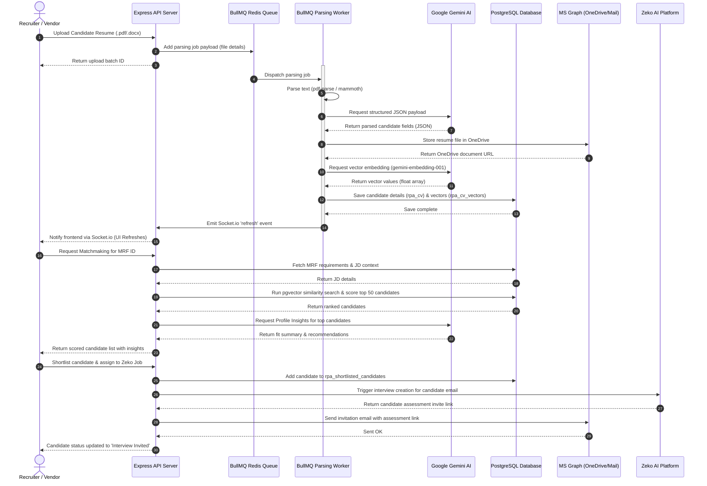

# Feature Modules & System Relationships

This document details the functional modules of the AAPNA ATS, their underlying logic, and how they interact to automate the recruitment pipeline.

---

## 🧩 Functional Modules Detail

### 1. User Authentication & Permissions
* **Role Classifications**:
  * `superadmin` / `admin`: Complete access to all routes, user approval controls, custom permissions, and settings configurations.
  * `recruiter` / `hr`: Standard operations access. Can upload CVs, submit MRFs, run screening matchmakers, and trigger interviews. Requires explicit activation by admin and module permissions.
  * `vendor`: Restricted external portal access. Can only upload CVs and view statuses of candidates submitted under their namespace.
* **Session Lifecycle**:
  * Sessions are persisted in the `rpa_sessions` database table.
  * Security token check: Session validity is validated on every authenticated API call. An automated `sessionCleanup` cron job sweeps and deletes expired session entries from the database every 2 hours.
  * Module-level permissions are stored in `rpa_module_permissions` (e.g., toggles for `analytics`, `email`, `screening`), which are checked dynamically via the `checkModuleAccess` middleware.

### 2. Dashboard & Metrics
* **Recruiter Analytics**:
  * Real-time metrics dashboard: aggregates recruitment funnel counts (total candidate profiles, active job openings/MRFs, and candidates currently in the interview stages).
  * Socket.io real-time connection: Emits updates when background parsing jobs finish, prompting the user interface dashboard tables to refresh instantly.

### 3. Manpower Requisition Form (MRF)
* **Requisition Submission**:
  * Hiring managers submit requisitions outlining positions, qualification criteria, mandatory/nice-to-have skills, and budget limits.
  * Google Gemini AI reads attached JDs and parses them into a structured JSON schema (`parsed_jd_json`) to ensure clean parameters.
* **Approval Lifecycle**:
  * Form requests default to `pending` status.
  * High-priority emails are dispatched via Microsoft Graph to senior leadership for review. Buttons in the email allow for direct approval or rejection.
  * node-cron scheduler sweeps `rpa_email_log` daily to send reminder alerts to reviewers until a decision is made.

### 4. Resume Upload, AI Parsing, & Deduplication
The upload pipeline extracts, structures, stores, and deduplicates candidate data:

```text
[File Uploaded] ──> [Text Extraction] ──> [Gemini AI Parsing] ──> [OneDrive Archiving]
                                                                        │
                                                                        v
[Real-time WebSocket Alert] <── [Deduplication Scan] <── [Insert/Update DB & Vector Store]
```

* **Text Extraction**: Supported formats include `.pdf` (using `pdf-parse`) and `.docx` (using `mammoth`).
* **Generative AI Structuring**:
  The extracted text is sent to Google Gemini (`gemini-2.5-flash`) with a system instruction requesting conversion into a structured JSON schema:
  ```json
  {
    "Name": "Candidate Name",
    "NoticePeriod": "Notice Period in days",
    "ContactNumber": "Phone Number",
    "EmailID": "Email Address",
    "HighestQualification": "Degrees obtained",
    "TotalExperienceYears": "Experience count",
    "CurrentCompany": "Company name",
    "ExpectedCTC_LPA": "CTC in LPA",
    "Top5KeySkills": ["Skill 1", "Skill 2"],
    "employment_history": [
      {
        "company": "Company Name",
        "tenure_months": 24,
        "designation": "Role Title"
      }
    ]
  }
  ```
* **OneDrive Storage**: Resumes are uploaded to a persistent cloud folder using Microsoft Graph client credentials.
* **Vector Store Injection**: The parsed JSON is stored in `rpa_cv_vectors` as a vector embedding (`gemini-embedding-001`) via PostgreSQL raw SQL operations (`$3::vector`).
* **Deduplication Engine**:
  * The system matches incoming records against existing profiles based on Name, Email, and Phone.
  * When a duplicate is found, the system logs the entry, halts the workflow, and prompts HR to resolve the conflict in the duplicate resolution center by either **merging** data points or **deleting** the duplicate.

### 5. Candidate Screening & Matchmaker
This is the core evaluation engine of the platform. Recruiters select an active MRF, and the system runs the screening logic.

#### pgvector Semantic Search
The system generates a semantic query from the MRF position title, mandatory skills, nice-to-have skills, and roles/responsibilities. It executes a cosine distance vector search (`<=>`) in PostgreSQL to pull the top 50 matches, filtered by experience and budget limits to ensure relevant matches:
```sql
SELECT c.id, v.embedding <=> $1::vector as distance
FROM rpa_cv_vectors v
JOIN rpa_cv c ON c.id = v.candidate_id
WHERE (c."TotalExperienceYearsNumeric" <= $2 OR $2 = 0)
  AND (c."ExpectedCTCNumeric" <= $3 OR $3 = 0)
ORDER BY distance ASC LIMIT 50
```

#### The 8-Parameter Scoring Algorithm
The top matches are scored deterministically out of 10 across 8 parameters:

1. **Total Experience**:
   * Evaluates Candidate total experience vs Role required experience.
   * If candidate experience is below required, returns `0` points.
   * If equal, returns `10` points.
   * Overshoot by $\le2$ years = `8` pts, $\le4$ years = `6` pts, $\le6$ years = `4` pts, else `2` pts.
2. **Relevant Experience**:
   * If candidate total experience is below required relevant years, returns `0` points.
   * If equal, returns `10` points.
   * Gap $\le1$ year = `8` pts, $\le2$ years = `6` pts, $\le3$ years = `4` pts, else `2` pts.
3. **Job Stability**:
   * Evaluates the longest continuous tenure in a single company (parsed from `employment_history`).
   * Compares the longest tenure to the candidate's total experience to generate stability scores (up to `10` points).
4. **Education Performance**:
   * Validates degree match (Technical Graduate vs Post Graduate).
   * Evaluates academic scores (10th, 12th, graduation): All $\ge70\%$ = `10` pts; All $\ge60\%$ = `8` pts; One below 60% = `6` pts; Two below 60% = `4` pts; else `2` pts.
5. **English Communication**:
   * Standardizes the communication rating: `5` $\rightarrow$ `10` pts; `4` $\rightarrow$ `8` pts; `3` $\rightarrow$ `6` pts; `2` $\rightarrow$ `4` pts; `1` $\rightarrow$ `2` pts.
6. **JD Skill Matching**:
   * Matches candidate key skills against the JD's requirements.
   * Calculated deterministically based on skill match percentage ($\ge90\%$ = `10` pts, $\ge70\%$ = `8` pts, $\ge50\%$ = `6` pts, $\ge30\%$ = `4` pts, else `2` pts).
   * Grounded with Google Gemini generative analysis and candidate `resume_technical_terms`: If a mandatory keyword matches technical terms, the score is adjusted up (up to `7` or `5`), else capped at a maximum of `4` points.
7. **CTC Alignment**:
   * Expected CTC vs Budget Max.
   * Expected CTC $\le$ Budget Max = `10` points.
   * Overshoot by $\le15\%$ = `8` pts, $\le30\%$ = `6` pts, $\le50\%$ = `4` pts, else `2` pts.
8. **Availability (Notice Period)**:
   * Period $\le15$ days = `10` points.
   * Period $\le30$ days = `8` points; $\le45$ days = `6` points; $\le60$ days = `4` points; else `2` points.

The final score is the arithmetic mean of all 8 parameters. Candidates with a final score $<5.0$ or a JD Skill Match $<3.0$ are filtered out.

#### Gemini AI Profile Insights
The top candidates are sent to Google Gemini to generate structured profile insights, including a fit verdict, recruitment recommendation, identified red flags, and a visual representation of skill gaps.

### 6. Zeko AI Interview Platform
* **Assignment**: Shortlisted candidates can be assigned to job flows synced from Zeko AI.
* **Execution**: Triggering an assignment creates a pipeline entry and calls Zeko API endpoints to generate an invite link for the candidate.
* **Tracking**: A scheduled cron job queries Zeko APIs for updates, importing coding scores, interview ratings, and report links back to the candidate's record.

---

## 🔄 Candidate Journey Sequence Diagram

Below is the workflow showing the interaction between modules when a candidate is processed:


